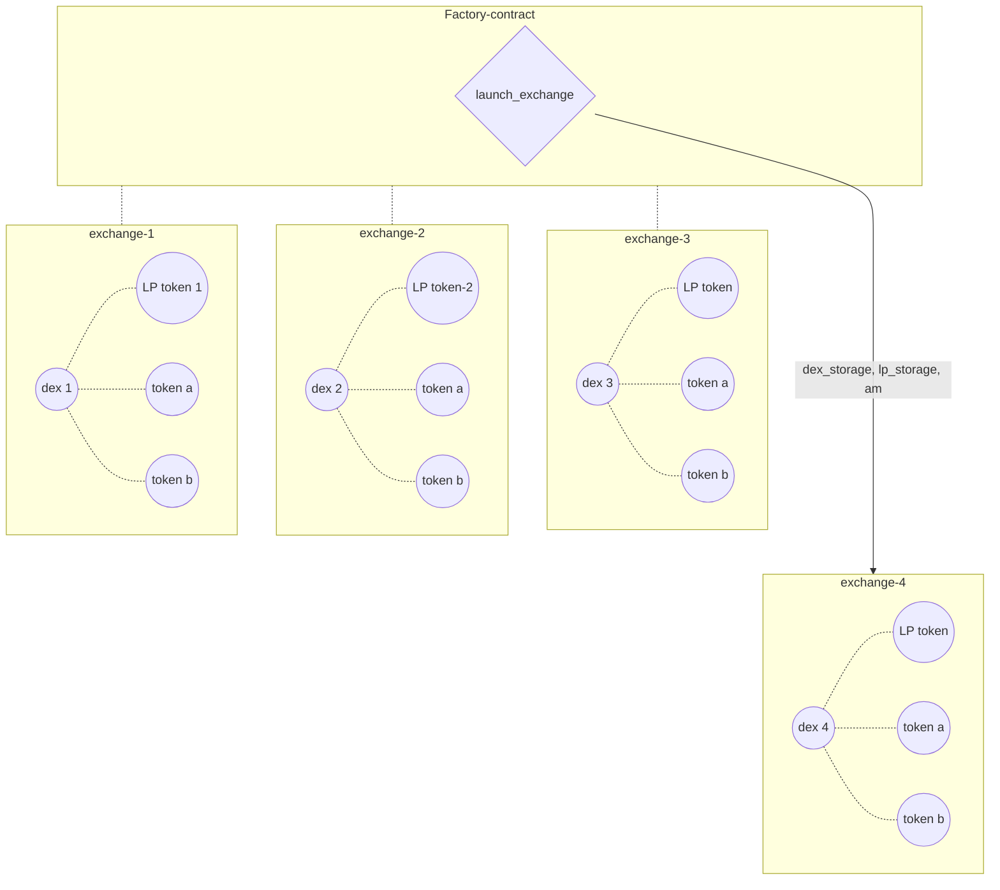
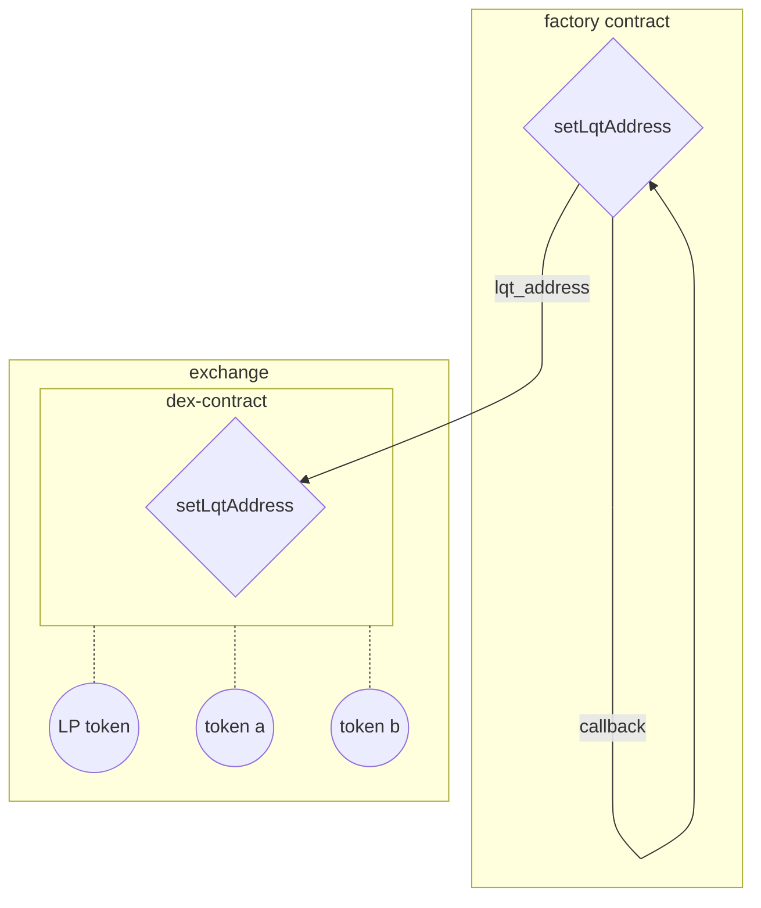
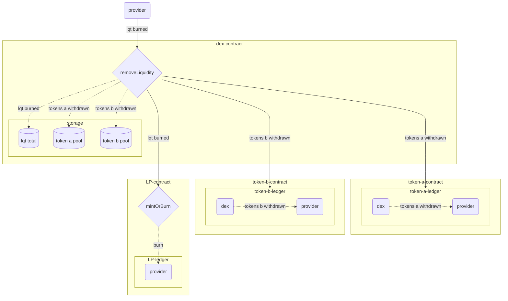
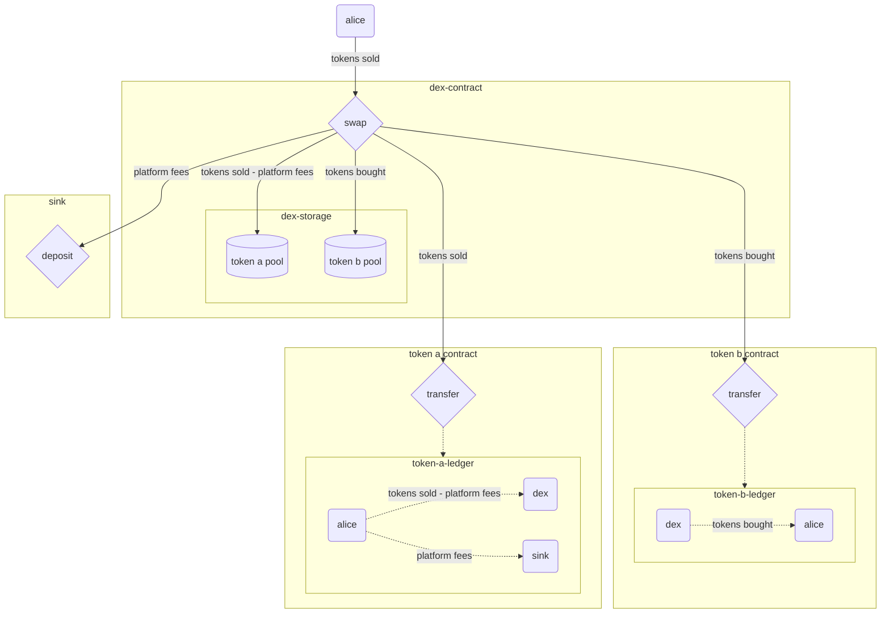
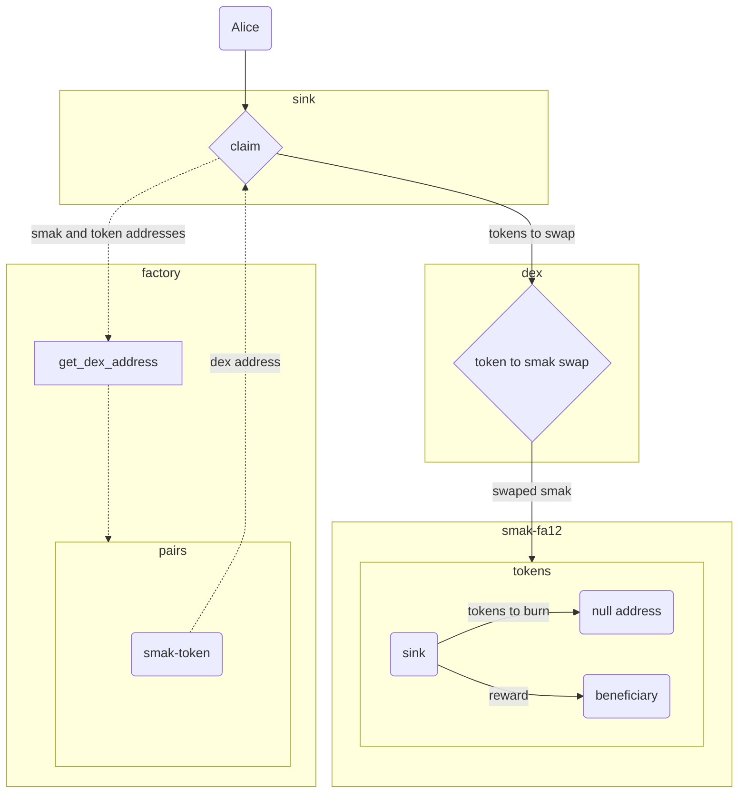

# Dcentralized Exchange Contracts

This is a description of a system composing a Decentralized Exchange (DEX) network.

## User Instructions:

### setup:

run the command `docker-compose up -d`

from the folder `project` run the command `./compile.sh` to compile all contracts.

### Deploy contracts:

From the folder `project/tests` run `python3 deploy.py`  
*if deployment is to the testnet, make sure the `SHELL = "http://localhost:20000"` line is commented, and the line below is uncommented*

The `deploy.py` file is set to deploy a factory with no exchanges on it.
To deploy a factory with an assortment of exchanges on it, uncomment the last line of `deploy.py`, and comment the line above it.
The factory's address and its sink contract address will be output at the `project/real_contracts.txt` file.

Individual exchanges can be launched by calling `factory.launchExchange(params).send(**send_conf)`
With `param` as described in the "launch exchange" section.

### Testing The Contracts:

All contract tests are in the folder `project/tests`.
To run a test run `python3 -m unittest test_file_name.py`.
For example: to run the factory tests, run `python3 -m unittest test_factory.py`.
Make sure that you run `docker-compose up -d` before running the tests.

## System Architecture

The system is comprised of the following smart-contracts, which interact with each other.

- **Factory:**  
A smart contract responsible for deploying key contracts, linking them to one another, setting up their initial storages and storing some important data regarding them.

- **Dex:**
The exchange contract, which handles the exchanges between a pair of tokens `a` and `b`, the exchange rates between the two, the liquidity of the tokens and fee distribution.

- **Sink:**
A contract that collects "buyback fees" from all the different exchanges, swaps the fees to the *SMAK* token and burns the collected *SMAK* tokens.

- **Liquidity Token:**
An **FA1.2** standard token contract, handling liquidity shares of all liquidity providers for a given *DEX* contract.

- **Sink Reward:**
A contract that rewards external user when trigering the *swap and burn* mechanism of the *Swap* contract.

- **baker rewards:**
A contract handing out of the baker rewards to liquidity providers.

### launch_exchange
This entry-point is used to launch the dex  contract and initialize its storage.

**Input parameters:**  
- `token_type_a` : token input;
- `token_type_b` : token output;
- `token_amount_a` : token input amount;
- `token_amount_b` : token output amount;
- `curve` : type of dex(constant product or flat curve);
- `lp_address` : lp token address;

### Set Liquidity Address:

### launch_sink
This entry-point is used to launch the sink contract.

### set_sink_claim_limit
This entry-point is used to update the maximum number of tokens allowed for the smak claim  (against the smak swap and burn).

**Input parameters:**  
- `param` : maximum number of tokens to be swaped to smak per user claim transaction.
---

## Dex

### add_liquidity

This entry-point is used to add liquidity to the pool.

**Input parameters:** 

- `owner` : address of the liquidity provider;
- `amount_token_a` : token input amount;
- `min_lqt_minted` : minmum lp amount accepted ;
- `max_tokens_deposited` : maximum token output amount accepted  ;
- `deadline` : the deadline of the transaction;

### remove_liquidity 
This entry-point is used to remove liquidity from the pool.

**Input parameters:** 

- `rem_to` : destination address ;
- `lqt_burned` : lp token amount;
- `min_token_a_withdrawn` : minmum token input amount accepted ;
- `min_token_b_withdrawn` : minmum token output amount accepted  ;
- `deadline` : the deadline of the transaction;

### swap

This entry-point is used to swap token a to token b.

**Input parameters:** 

- `t2t_to`: destination address ;
- `tokens_sold`: token input amount;
- `min_tokens_bought` : minmum token output amount accepted ;
- `a_to_b` : the direction of the swap ( if true from token a to token b , otherwise from token b to token a);
- `deadline` : the deadline of the transaction;

- This graph represents the general case, when both token_a and token_b are `fa1.2` or `fa2` fungible tokens. For the case when one of the tokens is `XTZ`, the model is the same, except that no `transfer` call is being made, but the amount is either deposited in the `dex` contract or transferred out of it.  
- In the graph, `token a` reffers to the sold token, and `token b` to the bought token. This is not always the case - the swap can be reversed to `token a` being the bought token and `token b` being the sold token. 

### Sink Claim

# Contract addresses:
Factory with no exchanges: KT1Dnzyn5Jx2C3Pb21G436KKjv1akRUs7e5Y
Sink: KT1KeJXrkuYJQV1Jwf1f5oWnmM4S7jFmJo3F

Factory with exchanges: KT1RQJwAQpvjTPDAQmWBAyMcLekh5LUpaKV8
Sink: KT1KJhuGpn8QvKDDB8nYvVyVvbiUZTDvBMpC
Exchange 1: KT1MJcPSBxei9v1TtQkBikcftd5omsPE48gm
Liquidity token 1: KT1NBcrbsKjmjnSGxBaqwDRr3Xo4AYg2fFVp
Exchange 2: KT1EDx1yf837ucDTF5zGRynUiJrx8UXHaTPV
Liquidity token 2: KT19UeguSJgcZSDc5ufExQ7KTkVzNrnzx7R4 