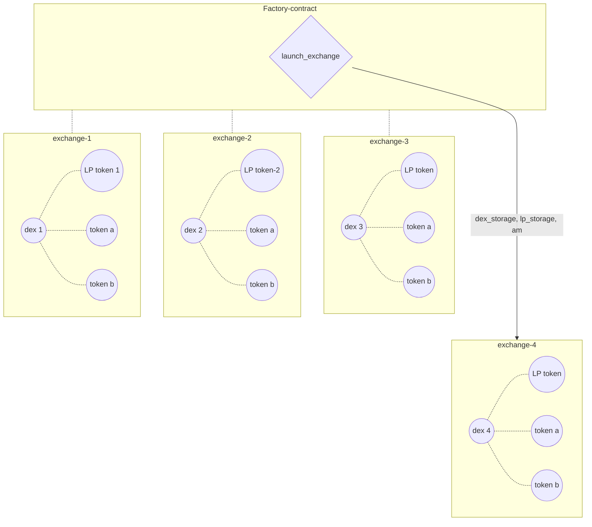
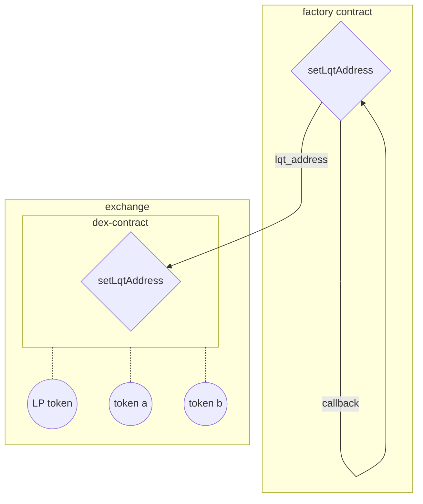
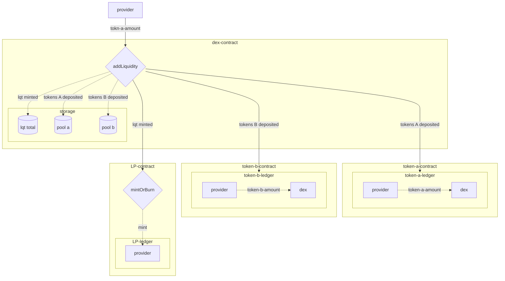
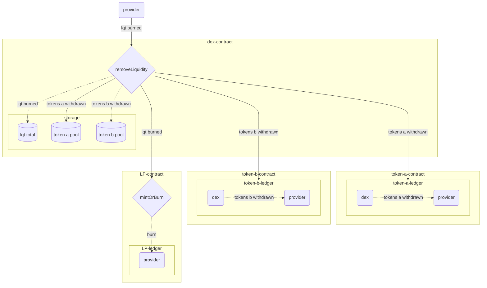
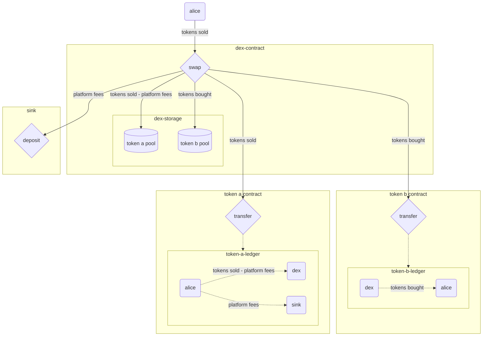
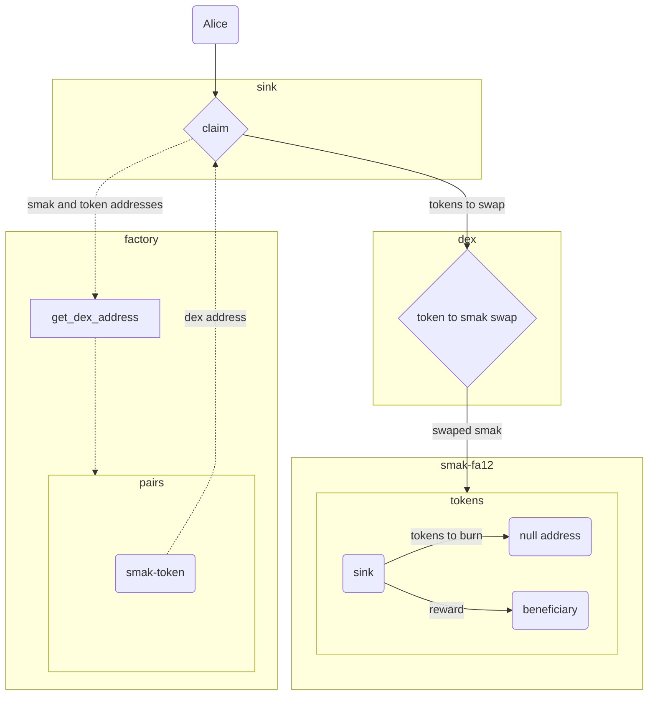

# Decentralized Exchange Contracts

This is a description of a system composing a Decentralized Exchange (DEX) network.

## User Instructions:

- Before attempting to do any of the following, make sure that all required modules are installed on your system.
From the `contracts` folder run `pip install -r requirements.txt` to install all required modules.

### Smart Contract compilation:

To compile all contracts, enter the `contracts` folder, and use the command `make compile`.

### Testing 

To run the tests, follow these steps: 
- run `make TESTNAME` from the root folder of the project (the `contracts` folder).
  *`TESTNAME`* is one of the following:
  - `test-env`
  - `test-factory`
  - `test-dex`
  - `test-sink`
  - `test-multisig`

All contracts are compiled before each time a test runs.

### Deployment:
To deploy the contracts:

From the root folder of the project (the `contracts` folder) run `make deploy network=NETWORK`
*NETWORK* is one of the following:
- `sandbox`
- `testnet`
- `mainnet`
If `mainnet` is chosen, you will be prompted to provide the following: 
- baker: a baker's address that will be used as the default baker for exchanges with `xtz` as one of the tokens.
- secret key: the secret key of the address that will be used for deployment and as initial admin of the platform.
- address: the address (`tz...` address) corresponding to the secret key.

If network is not `mainnet`, two FA1.2 contracts will be deployed, and two exchanges will be launched for simulation.

All contracts are compiled before each deployment.

*Important - When deploying the factory contract, `default_sink_address` has to be `None`, and only after deployment the factory's `launchSink` should be called. This ensures that the correct sink contract is indeed deployed. If the factory was deployed with a different contract, it can be changed to the correct contract by deploying manually the sink contract and calling `updateSinkAddress`, but this should be avoided.*

## System Architecture

The system is comprised of the following smart-contracts, which interact with each other.

- **Factory:**  
A smart contract responsible for deploying key contracts, linking them to one another, setting up their initial storages and storing some important data regarding them.

- **Dex:**
The exchange contract, which handles the exchanges between a pair of tokens `a` and `b`, the exchange rates between the two, the liquidity of the tokens and fee distribution.

- **Sink:**
A contract that collects "buyback fees" from all the different exchanges, swaps the fees to the *SMAK* token and burns the collected *SMAK* tokens.

- **Liquidity Token:**
An **FA1.2** standard token contract, handling liquidity shares of all liquidity providers for a given *DEX* contract.

- **Multisig:**
A contract controlling all administration actions in the system.
This contract gets called by the attempt to make an administrational action, and ensures that the call is valid. The administrational action has to be called by several different system admins until a `threshold` is satisfied.


### General Types:
Types used throughout the contracts.

**`token_type`** is a type introduced in order to generalize the pools.
Instead of having exchanges only between token(fa1.2 or fa2) to XTZ, in this version the native token `XTZ` is treated like all other tokens. To determine the interface that the exchange will interact with, the type of the exchange's tokens needs to be determined at the exchange launch.
`token_type` is one of the following:
`{"xtz": Unit (or None)}`
`{"fa12": address}`
`{"fa2": (address, token_id)}`

**`token_amount`** is another type introduced for letting the exchange determine the interface it interacts with.
`token_amount` is one of the following:
`{"mutez": nat}`
`{"amount": nat}`
`mutez` should be chosen at exchange launch for an `xtz` type pool's initial amount.
`amount` should be chosen for all other pool's initial amount.

**`curve`** is a type used to determine the exchange model of the exchange.
`curve` is one of the following:
`flat`
`product`

The `flat` curve sets a CFMM model to the exchange, that makes very accurate 1-to-1 ratio exchanges with very low slippage for very large ranges of amount-to-pool-size ratios, making it extremely usefull for pegged token pairs. When choosing the `flat` curve at exchange launch, the factory contract demands a 1-to-1 initial pool ratio.
The `product` curve sets a standard constant-product AMM model to the exchange. This model is more accurate for non-pegged token pairs, with varying exchange ratios.

## Factory
The factory contract is a contract handling all the system's set up.
It stores general information about the different exchanges, launches the contracts with default or varying values, and updates general settings for the contracts after launch.

*A multisig contract controls acces to all administration entrypoints, to make administration of the system more decentralized*  

**IMPORTANT: To avoid losing control of the multisig, an adition of multisig admin is recommended, with threshold lower than the number of admins. That way, if some one of the admins lose their keys or get hacked, those admins can be removed and replaced by other admins.**

### launch_exchange
This entry-point is used to launch the dex  contract and initialize its storage.

**Input parameters:**  
- `token_type_a` : `token_type`; (input token)
- `token_type_b` : `token_type`; (second input token)
- `token_amount_a` : `token_amount`; (token input amount)
- `token_amount_b` : `token_amount` ; (second token input amount)
- `curve` : `curve`;  type of dex(constant product or flat curve)
- `metadata` : the metadata fields of the exchange's LP token contract
- `token_metadata` : the metadata fields for the exchange's LP token




The `launchExchange` calls two entrypoints - the `setBaker` entrypoint and the `setLqtAddress` entrypoint.

#### Set baker:
This is an internal entrypoint, called only by the `launchExchange` entrypoint. It adds a baker to all exchanges with an `XTZ` pool.
The `baker` is determined by the factory's `default_baker` storage entry.
For exchanges with no `XTZ` pools, the baker address remains `None`, and `freeze_baker` is set as `True`. All baker reward related actions are disabled for these exchanges.
#### Set LQT address
This is an internal entrypoint, called by the `launchExchange` entrypoint. It adds a newly deployed LP token's FA1.2 contract to the launched exchange, with the metadata sent as input to the `launchExchange` entrypoint.

### Remove exchange:
This entrypoint is used to remove an individual exchange from the factory's entries. The exchange can still be active after its removal, but is not linked to the system and can be replaced by a differnt exchange for its tokens.

Input Parameters:
`token_a : token_type` One of the removed exchange's tokens.
`token_b : token_type` The second removed exchange's token.
`index` The index of the exchange, corresponding to this exchange's id in the `pools` mapping.

The order of `token_a, token_b` doesn't matter, but the pair of tokens has to point to the same exchange as the index does.

### Launch sink:
This entrypoint is used to deploy a sink contract that will be used by all the exchanges.
If the sink is not launched, the `launchExchange` entrypoint will fail.
No input parameters are required by this entrypoint, but it is being controlled by multisig.

### Update sink address:
This entrypoint assignes a new sink contract to all exchanges.

Input Parameters:
To avoid reaching the operation gas limit, because this entrypoint calls multiple contracts to update them, the range of pools to update is input at the entrypoint call.
This range is determined by the parameters:
`first_pool : nat`
`number_of_pools : nat`
The third parameter is `new_sink_address : address`.

This entrypoint, as all administration entrypoints, is controlled by multisig.
The new sink contract should have the same interface, to be compatible with the different sink calls, but the logic can be different if needed.

### Set sink claim limit:
This entrypoint is used to change the number of tokens that can be burnt and claimed.
Due to the limit of aproximately 1 milion gas units allowed per transaction, when the number of tokens in the system gets larger, with a maximum gas consumed for token claim of about 20500 (FA2 tokens), the number of tokens has to be limited. The limit is stored in the sink's `token_claim_limit` field, and is set by the factory's `default_claim_limit`. This limit can be adjusted by the `setSinkClaimLimit` entrypoint if needed.

Input parameter: `nat` : the new claim limit.
This entrypoint is also controlled by a multisig.


### Set Liquidity Address:
This entrypoint is used as a callback when the `launchExchange` entrypoint is called. It sets an individual exchange's liquidity-token address.




### Update baker
This entrypoint is used to change the baker for all exchanges with an `XTZ` pool. It also updates the `default_baker` storage entry, for future exchange launches.
In case there are many exchanges, the number of pools for which the baker is updated can be limited.
The individual exchanges for which the update is made are accessed by their index in the `pools` big_map. updates are made incrementally for all exchanges in the range `first_pool` to `first_pool + number_of pools`.

Input Parameters:  
`baker : key_hash` the new baker's address.
`first_pool : nat` the first pool in the update range.
`number_of_pools` the the number of pools to increment and update over.

---

## Dex

### add_liquidity

This entry-point is used to add liquidity to the pool.
The user specifies the amount of `token_a` to be added to `token_pool_a`. the amount of `token_b` to be sent and the liquidity tokens to be minted are calculated according to the exchange's `curve` type.
`min_lqt_minted` is set so that no less liquidity tokens than the desired amount will be minted. If the amount minted, calculated by the entrypoint, is lower than this value, the operation will fail.
`max_tokens_deposited` is set so that no more `token_b` amount than the amount desired will be deposited. If the amount calculated by the entrypoint is higher than this value, the operation will fail.
The `owner` can be an address other than the sender's, in case a sender wants to mint liquidity for a different address.

**Input parameters:** 

- `owner` : address of the liquidity provider;
- `amount_token_a` : token input amount;
- `min_lqt_minted` : minmum lp amount accepted ;
- `max_tokens_deposited` : maximum token output amount accepted  ;
- `deadline` : the deadline of the transaction;



### remove_liquidity 
This entry-point is used to remove liquidity from the pool.
The `lqt_burned` determines how many LP tokens will be sold and burned. Amounts of `token_a` and `token_b` that will be sent in return to the `rem_to` address is calculated by the entrypoint.
If the amount calculated for `token_a` and `token_b` is lower than `min_token_a_withdrawn` and `min_token_b_withdrawn` respectively, the operation will fail.

**Input parameters:** 

- `rem_to` : destination address ;
- `lqt_burned` : lp token amount;
- `min_token_a_withdrawn` : minmum token_a amount accepted ;
- `min_token_b_withdrawn` : minmum token_b amount accepted  ;
- `deadline` : the deadline of the transaction;



### swap

This entry-point is used to swap token a to token b.
The `tokens_sold` value sets the amount of tokens to be sold. The token sold is determined by the `a_to_b` boolean value. If `a_to_b` is `True`, `token_a` is sold and `token_b` is bought, if it is `False`, `token_b` is sold and `token_a` is bought.
The amount of tokens bought is calculated according to the exchange's `curve`, and so are the fees related to the swap.
Fees are reduced from the amount of tokens sold before the amount of tokens bought is calculated.
Platform fees (burn and reserve) are sent to the sink contract, from which they can be claimed by any user. The percentage of platform fees is 0.03% of `tokens_sold`
LP fees are added to the liquidity of the sold token pool, inflating the return of tokens when `removeLiquidity` is called. The percentage of LP fees is 0.25% `tokens_sold` for constant-product `curve`, and 0.07% `tokens_sold` for flat `curve`.
`t2t_to` is the address to which the tokens bought will be transferred.

**Input parameters:** 

- `t2t_to`: destination address ;
- `tokens_sold`: token input amount;
- `min_tokens_bought` : minmum token output amount accepted ;
- `a_to_b` : the direction of the swap ( if true from token a to token b , otherwise from token b to token a);
- `deadline` : the deadline of the transaction;

- This graph represents the general case, when both token_a and token_b are `fa1.2` or `fa2` fungible tokens. For the case when one of the tokens is `XTZ`, the model is the same, except that no `transfer` call is being made, but the amount is either deposited in the `dex` contract or transferred out of it.  
- In the graph, `token a` reffers to the sold token, and `token b` to the bought token. This is not always the case - the swap can be reversed to `token a` being the bought token and `token b` being the sold token. 



### Default:
The `default` entrypoint is used to send `xtz` to the DEX contract. This entrypoint is only accessible for exchanges with `xtz` as one of the tokens.
The `default` entrypoint is used to handle baker rewards, and the amount sent to it is added to the `rewards` field.
No input parameters are required.

### Claim reward:
This entrypoint is used to claim individual baker rewards by liquidity providers.

Input parameter: `address` the address to which the baker rewards will be sent.

### Update token pool:
This entrypoint is used to update the token pool, if some changes were made to the token contract's balance.
No input parameters are required by this entrypoint.
The `updateTokenPoolInternal` entrypoint is called by this entrypoint.

### Administration entrypoints:
The following entrypoints are administration entrypoints, accessed only by the factory.
#### Set baker:
Used to set the baker's address, for exchanges containing `XTZ` as one of the tokens.
#### Set LQT address:
Used to set an LP token address. Used only at exchange launch.
#### Update sink address:
Used to update the sink's address.

## Sink

### Claim

This entrypoint is used to send protocol fees to swap (for buying SMAK tokens and burning them - buyback and burn mechanism) - `burn` fees, and to the reserve - `reserve` fees.
Calling this entrypoint is incentivised by some percentage of the bought SMAK tokens at the buyback proccess being sent to the entrypoint caller or another chosen address.
The number of tokens to claim is limited by the transaction gas limit, so a list of tokens `tokens` is chosen by the caller with up to the `token_claim_limit` tokens.

Input Parameters:
`reward_to : address` the address to which the reward will be sent;
`tokens : token_type list` the tokens to be claimed;
`deadline : timestamp` transaction deadline;

**Important: If a token was chosen that has no exchange with SMAK token, the operation will fail as this token cannot be swapped to SMAK in order to burn!**



### Deposit:
This entrypoint is called by the exchange's `swap` entrypoint, and is used to deposit platform fees to the `burn` and `reserve` big_maps.

### Administrations entrypoints:
The administration entrypoints can only be accessed by the factory.
#### Add exchange:
This entrypoint is used to add a newly launched exchange, and configure the tokens used by it.

#### Remove exchange:
This entrypoint is used to remove an exchange from the `exchanges` big_map, in case this exchange was removed from the factory.

#### Update claim limit:
This entrypoint is used to update the maximum number of tokens to be claimed.


## Multisig:
The multisig contract is used to control the factory's administration entrypoints.
All entrypoints except the `call` entrypoint are being controlled by the multisig and are sent as callbacks to the `call` entrypoint.

### Call:
This entrypoint is the main entrypoint of the multisig contract.
It accepts entrypoint signatures and callback functions from the entrypoint calling it, and activates the callback once the `threshold` is reached.
Several conditions must be met to authenticate the operation of this entrypoint:
- The `sender` of the call has to be one of the multisig's `authorized_contracts`.
- The `sender` of the call has to be the `source_contract` stated by the `entrypoint_signature`.
- The `source` of the call has to be one of the multisig's `admins`.

Input Parameters:
```
entrypoint_signature : 
{
    name : string;
    params : bytes;
    source_contract : address;
}
```
`callback : unit -> operation list;` the callback function activated when `threshold` is reached.

### Administration Entrypoints:

#### Add authorized contract:
This entrypoint is used to add a contract to the `authorized_contracts` set.

Input parameter:
`address` the new contract to be added.

#### Remove authorized contract:
This entrypoint is used to remove a contract from the `authorized_contracts` set.

Input parameter:
`address` the contract to be removed.

#### Add admin:
This entrypoint is used to add an admin to the `admins` set.

Input parameter:
`address` the address of the added admin.

#### Remove admin:
This entrypoint is used to remove an admin from the `admins` set.
When removing an admin two conditions have to be met:
- The number of admins cannot be zero.
- The number of admins cannot be lower than the `threshold` of the multisig.

Input parameter:
`address` the address of the removed admin.

#### Set threshold:
This entrypoint is used to set a new `threshold` for the multisig.
When setting a new threshold, two conditions have to be met:
- The threshold cannot be zero.
- The threshold cannot be higher than the number of admins in the `admins` set.

Input parameter:
`nat` The value of the new threshold.

#### Set duration:
This entrypoint is used to set a new duration for calls. If this duration is passed, a call will be restarted, requiring admins to vote again.

Input parameter:
`nat` the new duration (in seconds).


## Error Codes:

| Code | Thrown by  | Message                                                                                                       |
|------|------------|---------------------------------------------------------------------------------------------------------------|
| 101  | Factory    | The two tokens are equal                                                                                      |
| 102  | Factory    | The pair already exists                                                                                       |
| 103  | Factory    | Pools cannot be empty                                                                                         |
| 104  | Factory    | Sink contract was not deployed yet                                                                            |
| 105  | Factory    | FA1.2 contract has no `transfer` entrypoint (for transfer operations)                                         |
| 106  | Factory    | FA2 contract has no `transfer` entrypoint (for transfer operations)                                           |
| 107  | Factory    | Contract is not of type `unit` (for transfer operations)                                                      |
| 108  | Factory    | Chosen `first_pool` for `updateBaker` is out of the factory's pool range                                      |
| 109  | Factory    | Only factory contract can call `setLqtAddress` entrypoint                                                     |
| 110  | Factory    | DEX contract has no `setLqtAddress` entrypoint                                                                |
| 111  | Factory    | Factory contract has no `setLqtAddress` entrypoint                                                            |
| 112  | Factory    | Sink contract has already been deployed                                                                       |
| 113  | Factory    | The pair of tokens sent to `get_dex_address` is not registered in the factory's `pairs`                       |
| 114  | Factory    | Exchange has no `setBaker` entrypoint                                                                         |
| 115  | Factory    | Factory has no `updateBaker` entrypoint                                                                       |
| 116  | Factory    | Factory has no `setSinkClaimLimit` entrypoint                                                                 |
| 117  | Factory    | Factory has no `updateMultisig` entrypoint                                                                    |
| 118  | Factory    | Factory has no `updateSinkAddress` entrypoint                                                                 |
| 119  | Factory    | Only the factory contract can call `setBaker` entrypoint                                                      |
| 120  | Factory    | DEX contract has no `setBaker` entrypoint                                                                     |
| 121  | Factory    | Factory contract has no `setBaker` entrypoint                                                                 |
| 122  | Factory    | DEX contract has no `get_tokens` onchain view                                                                 |
| 123  | Factory    | Factory has no `removeExchange` entrypoint                                                                    |
| 124  | Factory    | Sink contract has no `addExchange` entrypoint                                                                 |
| 125  | Factory    | Factory has no `launchSink` entrypoint                                                                        |
| 126  | Factory    | Sink contract has no `updateClaimLimit` entrypoint                                                            |
| 128  | Factory    | A DEX with flat-curve model needs to be deployed with equal pool sizes                                        |
| 130  | Factory    | Counter sent to `updateSinkAddress` entrypoint is outside the pool count                                      |
| 131  | Factory    | DEX contract has no `updateSink` entrypoint                                                                   |
| 132  | Factory    | One of the launched DEX tokens is `xtz` and the `amount` sent at launch is not correct                        |
| 136  | Factory    | The pair of tokens sent to `removeExchange` entrypoint does not fit any DEX registered                        |
| 137  | Factory    | The index sent to `removeExchange` entrypoint does not fit any DEX registered                                 |
| 138  | Factory    | The pair of tokens and the index sent to `removeExchange` entrypoint are of different DEXs                    |
| 139  | Factory    | Sink contract does not have a `removeExchange` entrypoint                                                     |
| 140  | Factory    | Index sent tp `get_dex_by_index` onchain view does not fit any DEX registered                                 |
| 141  | Factory    | `token_amount_a` type should be `amount` (for token sent to `launchExchange` entrypoint)                      |
| 142  | Factory    | `token_amount_a` type should be `mutez` (for `xtz` sent to `launchExchange entrypoint)                        |
| 143  | Factory    | `token_amount_b` type should be `amount` (for token sent to `launchExchange` entrypoint)                      |
| 144  | Factory    | `token_amount_b` type should be `mutez` (for `xtz` sent to `launchExchange entrypoint)                        |
| 201  | DEX        | `updateTokenPool` operation is in progress                                                                    |
| 202  | DEX        | Deadline is over for `addLiquidity` request                                                                   |
| 203  | DEX        | `max_tokens_deposited` sent to `addLiquidity` entrypoint is exceeded                                          |
| 204  | DEX        | LP tokens minted for LP are less than `min_lqt_minted` sent to `addLiquidity` entrypoint                      |
| 205  | DEX        | FA1.2 contract has no `transfer` entrypoint (for transfer operations)                                         |
| 206  | DEX        | FA2 contract has no `transfer` entrypoint (for transfer operations)                                           |
| 207  | DEX        | Contract is not of type `unit` (for transfer operations)                                                      |
| 208  | DEX        | `lqt_address` is not set                                                                                      |
| 209  | DEX        | LP token contract has no `mintOrBurn` entrypoint                                                              |
| 210  | DEX        | Deadline is over for `removeLiquidity` request                                                                |
| 211  | DEX        | Amount of `token_a` withdrawn is less than `min_token_a_withdrawn` sent to `removeLiquidity`                  |
| 212  | DEX        | `lqt_burned` sent to `removeLiquidity` is higher than the DEX's `lqt_total`                                   |
| 213  | DEX        | Tokens withdrawn by `removeLiquidity` operation is more than the token's pool size                            |
| 214  | DEX        | Deadline is over for `swap` request                                                                           |
| 215  | DEX        | The tokens bought by the swap are less than `min_tokens_bought` sent to the `swap` entrypoint                 |
| 216  | DEX        | Tokens bought at swap are more than the token's pool size                                                     |
| 217  | DEX        | Incorrect `amount` was sent to `addLiquidity` entrypoint                                                      |
| 218  | DEX        | The LP token's `balance_of_view` returned an error                                                            |
| 219  | DEX        | Amount of `token_b` withdrawn is less than `min_token_b_withdrawn` sent to `removeLiquidity`                  |
| 220  | DEX        | Only the `manager` can call `setLqtAddress` entrypoint                                                        |
| 221  | DEX        | A swap was made with no tokens received in return                                                             |
| 222  | DEX        | Non existing entrypoint FA2 (for `update_token_pool` operation)                                               |
| 223  | DEX        | Non existing entrypoint FA1.2 (for `update_token_pool` operation)                                             |
| 224  | DEX        | Invalid FA2 token contract missing `balance_of` (for `update_token_pool` operation)                           |
| 225  | DEX        | Invalid FA1.2 token contract missing `get_balance` (for `update_token_pool` operation)                        |
| 226  | DEX        | Invalid FA2 balance response (for `update_token_pool` operation)                                              |
| 227  | DEX        | `update_token_ended` function not found in DEX contract (for `update_token_pool` operation)                   |
| 228  | DEX        | Call not from an implicit account (for `update_token_pool` operation)                                         |
| 229  | DEX        | `self_is_updating_token_pool` must be false to call entrypoint                                                |
| 230  | DEX        | This entrypoint may be called only by `get_balance` of the token contract (for `update_token_pool` operation) |
| 231  | DEX        | No amount to be sent                                                                                          |
| 232  | DEX        | Only `manager` can update the sink's address                                                                  |
| 233  | DEX        | Only `manager` can set baker                                                                                  |
| 234  | DEX        | Baker is pemanently frozen                                                                                    |
| 238  | DEX        | Amount must be sent                                                                                           |
| 239  | DEX        | Sink contract has no `deposit` entrypoint                                                                     |
| 249  | DEX        | User's LP token balance is not enough for `removeLiquidity` operation                                         |
| 250  | DEX        | User's baker reward is larger than the contract's balance                                                     |
| 251  | DEX        | No baker rewards for this DEX                                                                                 |
| 300  | Sink       | DEX contract has no `swap` entrypoint                                                                         |
| 304  | Sink       | FA2 contract has no `updateOperators` entrypoint                                                              |
| 305  | Sink       | FA1.2 contract has no `approve` entrypoint                                                                    |
| 306  | Sink       | FA1.2 contract has no `transfer` entrypoint                                                                   |
| 307  | Sink       | FA2 contract has no `transfer` entrypoint                                                                     |
| 308  | Sink       | No `unit` contract found                                                                                      |
| 313  | Sink       | Token to burn is not listed                                                                                   |
| 314  | Sink       | Token to reserve is not listed                                                                                |
| 317  | Sink       | Token list is larger than `claim_limit`                                                                       |
| 318  | Sink       | Only Factory contract can call `updateClaimLimit` entrypoint                                                  |
| 319  | Sink       | Only Factory contract can call `addExchange` entrypoint                                                       |
| 320  | Sink       | No smak-to-token exchange exists                                                                              |
| 321  | Sink       | Token pair does not exist in the contract's `exchanges`                                                       |
| 322  | Sink       | Only a listed DEX contract can deposit tokens                                                                 |
| 323  | Sink       | Empty token list was sent to claim                                                                            |
| 324  | Sink       | Exchange to remove is not listed                                                                              |
| 327  | Sink       | Token pair and DEX address sent to `removeExchange` are not for the same exchange                             |
| 328  | Sink       | Only Factory contract can call `removeExchange` entrypoint                                                    |
| 1001 | Multisig   | Caller is not a multisig admin                                                                                |
| 1005 | Multisig   | Admin set cannot be empty                                                                                     |
| 1006 | Multisig   | Threshold is higher than the `admins` set size                                                                |
| 1007 | Multisig   | Threshold cannot be zero                                                                                      |
| 1008 | Multisig   | Caller voted already on proposal                                                                              |
| 1009 | Multisig   | Calling contract is not in `authorized_contract`                                                              |
| 1010 | Multisig   | `admins` set size must be larger than threshold                                                               |
| 1012 | Multisig   | The call signature's `source_contract` is not the same as the calling address                                 |
| 1013 | Multisig   | The proposal's `duration` cannot be zero                                                                      |
