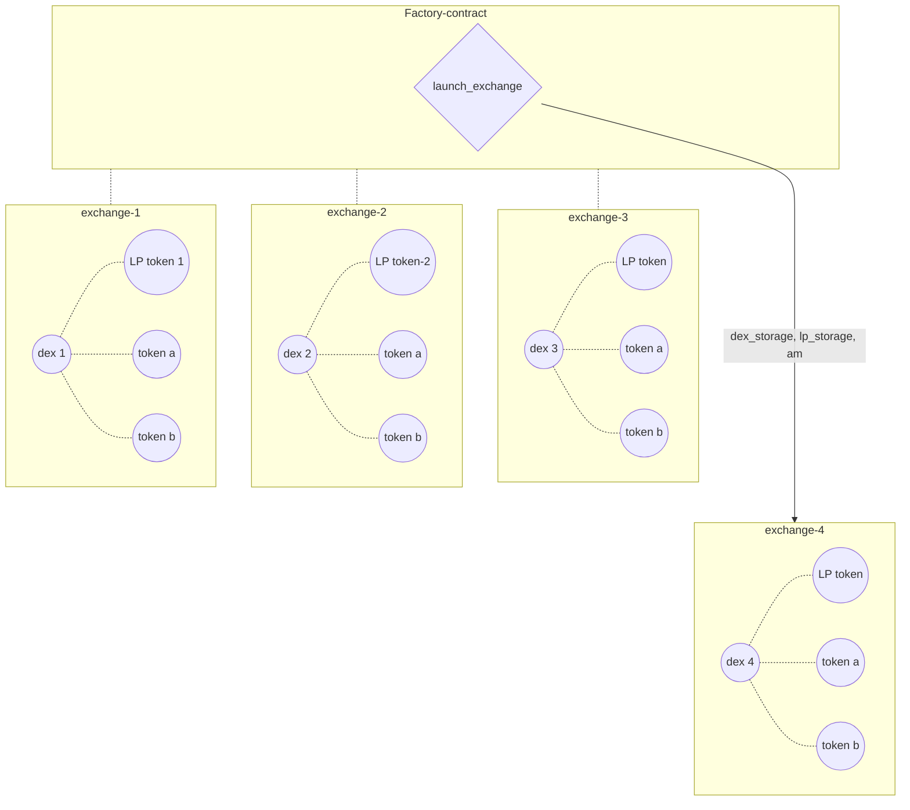
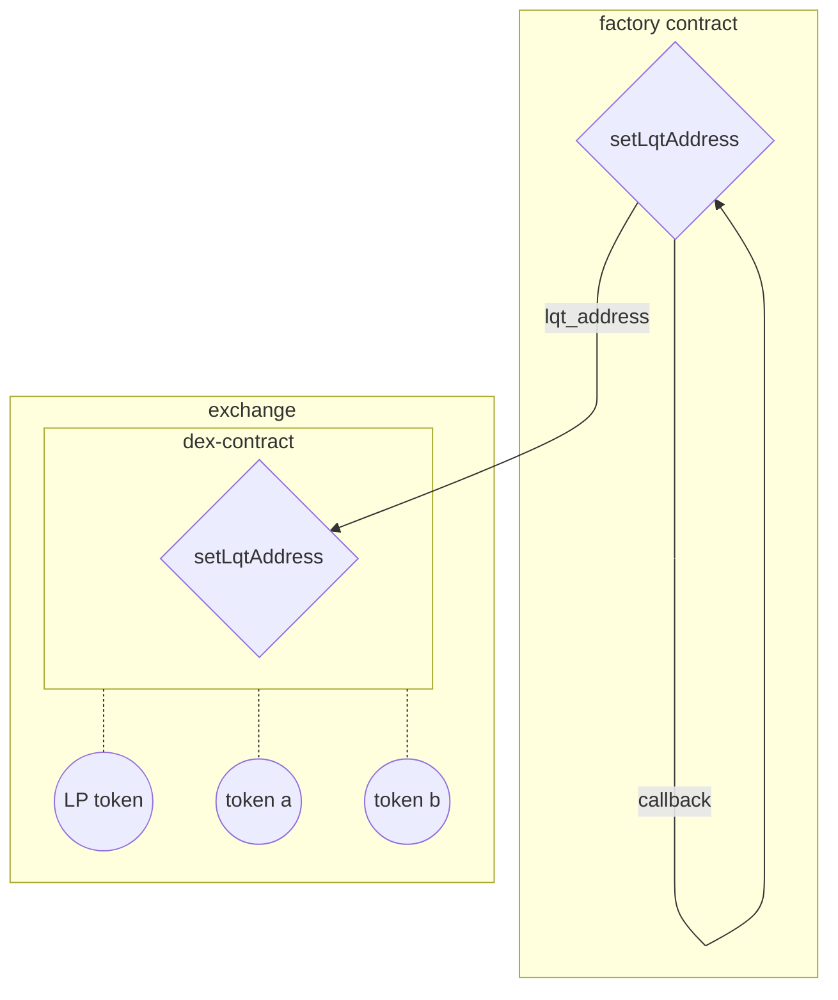
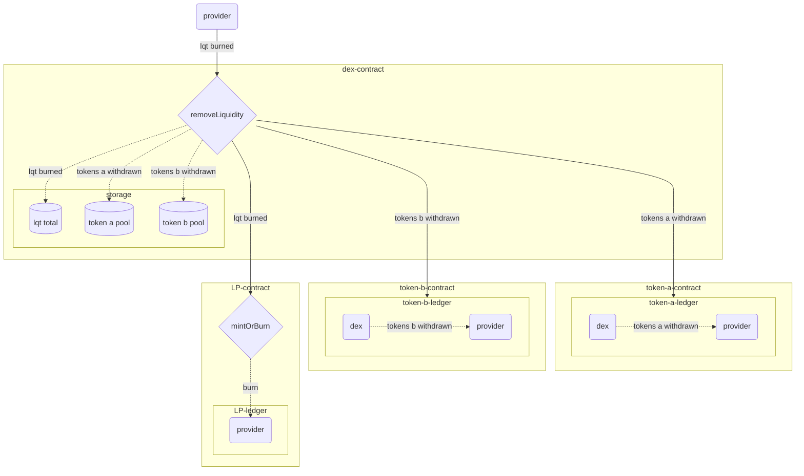
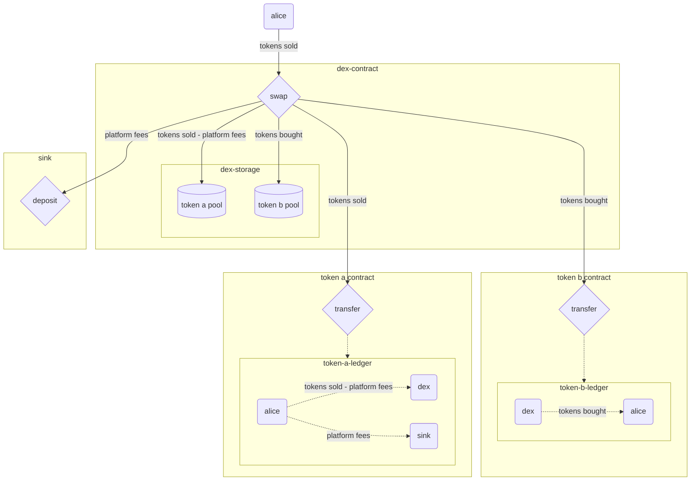
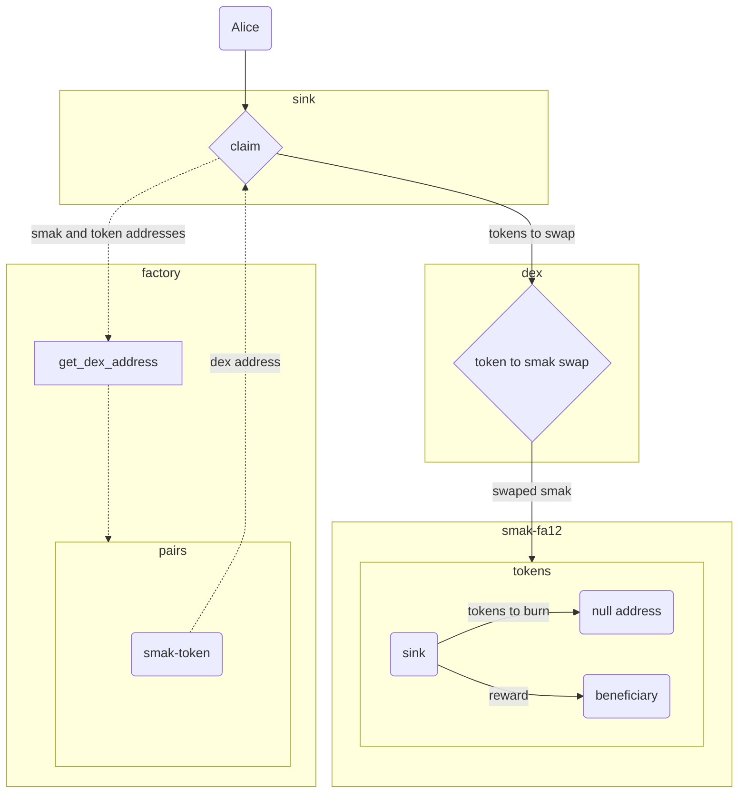

# Dcentralized Exchange Contracts

This is a description of a system composing a Decentralized Exchange (DEX) network.

## System Architecture

The system is comprised of the following smart-contracts, which interact with each other.

- **Factory:**  
A smart contract responsible for deploying key contracts, linking them to one another, setting up their initial storages and storing some important data regarding them.

- **Dex:**
The exchange contract, which handles the exchanges between a pair of tokens `a` and `b`, the exchange rates between the two, the liquidity of the tokens and fee distribution.

- **Sink:**
A contract that collects "buyback fees" from all the different exchanges, swaps the fees to the *SMAK* token and burns the collected *SMAK* tokens.

- **Liquidity Token:**
An **FA1.2** standard token contract, handling liquidity shares of all liquidity providers for a given *DEX* contract.

- **Sink Reward:**
A contract that rewards external user when trigering the *swap and burn* mechanism of the *Swap* contract.

### General Types:
Types used throughout the contracts.

**`token_type`** is a type introduced in order to generalize the pools.
Instead of having exchanges only between token(fa1.2 or fa2) to XTZ, in this version the native token `XTZ` is treated like all other tokens. To determine the interface that the exchange will interact with, the type of the exchange's tokens needs to be determined at the exchange launch.
`token_type` is one of the following:
`{"xtz": Unit (or None)}`
`{"fa12": address}`
`{"fa2": (address, token_id)}`

**`token_amount`** is another type introduced for letting the exchange determine the interface it interacts with.
`token_amount` is one of the following:
`{"mutez": nat}`
`{"amount": nat}`
`mutez` should be chosen at exchange launch for an `xtz` type pool's initial amount.
`amount` should be chosen for all other pool's initial amount.

**`curve`** is a type used to determine the exchange model of the exchange.
`curve` is one of the following:
`flat`
`product`

The `flat` curve sets a CFMM model to the exchange, that makes very accurate 1-to-1 ratio exchanges with very low slippage for very large ranges of amount-to-pool-size ratios, making it extremely usefull for pegged token pairs. When choosing the `flat` curve at exchange launch, the factory contract demands a 1-to-1 initial pool ratio.
The `product` curve sets a standard constant-product AMM model to the exchange. This model is more accurate for non-pegged token pairs, with varying exchange ratios.

## Factory
The factory contract is a contract handling all the system's set up.
It stores general information about the different exchanges, launches the contracts with default or varying values, and updates general settings for the contracts after launch.

*A multisig contract controls acces to all administration entrypoints, to make administration of the system more decentralized*

### launch_exchange
This entry-point is used to launch the dex  contract and initialize its storage.

**Input parameters:**  
- `token_type_a` : `token_type`; (input token)
- `token_type_b` : `token_type`; (second input token)
- `token_amount_a` : `token_amount`; (token input amount)
- `token_amount_b` : `token_amount` ; (second token input amount)
- `curve` : `curve`;  type of dex(constant product or flat curve)
- `metadata` : the metadata fields of the exchange's LP token contract
- `token_metadata` : the metadata fields for the exchange's LP token

### Remove exchange:
This entrypoint is used to remove an individual exchange from the factory's entries. The exchange can still be active after its removal, but is not linked to the system and can be replaced by a differnt exchange for its tokens.

Input Parameters:
`token_a : token_type` One of the removed exchange's tokens.
`token_b : token_type` The second removed exchange's token.
`index` The index of the exchange, corresponding to this exchange's id in the `pools` mapping.

The order of `token_a, token_b` doesn't matter, but the pair of tokens has to point to the same exchange as the index does.

### Launch sink:
This entrypoint is used to deploy a sink contract that will be used by all the exchanges.
If the sink is not launched, the `launchExchange` entrypoint will fail.
No input parameters are required by this entrypoint, but it is being controlled by multisig.

### Update sink address:
This entrypoint assignes a new sink contract to all exchanges.

Input Parameters:
To avoid reaching the operation gas limit, because this entrypoint calls multiple contracts to update them, the range of pools to update is input at the entrypoint call.
This range is determined by the parameters:
`first_pool : nat`
`number_of_pools : nat`
The third parameter is `new_sink_address : address`.

This entrypoint, as all administration entrypoints, is controlled by multisig.
The new sink contract should have the same interface, to be compatible with the different sink calls, but the logic can be different if needed.

### Set sink claim limit:
This entrypoint is used to change the number of tokens that can be burnt and claimed.
Due to the limit of aproximately 1 milion gas units allowed per transaction, when the number of tokens in the system gets larger, with a maximum gas consumed for token claim of about 20500 (FA2 tokens), the number of tokens has to be limited. The limit is stored in the sink's `token_claim_limit` field, and is set by the factory's `default_claim_limit`. This limit can be adjusted by the `setSinkClaimLimit` entrypoint if needed.

Input parameter: `nat` : the new claim limit.
This entrypoint is also controlled by a multisig.

### Set Liquidity Address:
This entrypoint is used as a callback when the `launchExchange` entrypoint is called. It sets an individual exchange's liquidity-token address.

### launch_sink
This entry-point is used to launch the sink contract.

### set_sink_claim_limit
This entry-point is used to update the maximum number of tokens allowed for the smak claim  (against the smak swap and burn).

**Input parameters:**  
- `param` : maximum number of tokens to be swaped to smak per user claim transaction.
---

## Dex

### add_liquidity

This entry-point is used to add liquidity to the pool.

**Input parameters:** 

- `owner` : address of the liquidity provider;
- `amount_token_a` : token input amount;
- `min_lqt_minted` : minmum lp amount accepted ;
- `max_tokens_deposited` : maximum token output amount accepted  ;
- `deadline` : the deadline of the transaction;

### remove_liquidity 
This entry-point is used to remove liquidity from the pool.

**Input parameters:** 

- `rem_to` : destination address ;
- `lqt_burned` : lp token amount;
- `min_token_a_withdrawn` : minmum token input amount accepted ;
- `min_token_b_withdrawn` : minmum token output amount accepted  ;
- `deadline` : the deadline of the transaction;

### swap

This entry-point is used to swap token a to token b.

**Input parameters:** 

- `t2t_to`: destination address ;
- `tokens_sold`: token input amount;
- `min_tokens_bought` : minmum token output amount accepted ;
- `a_to_b` : the direction of the swap ( if true from token a to token b , otherwise from token b to token a);
- `deadline` : the deadline of the transaction;

- This graph represents the general case, when both token_a and token_b are `fa1.2` or `fa2` fungible tokens. For the case when one of the tokens is `XTZ`, the model is the same, except that no `transfer` call is being made, but the amount is either deposited in the `dex` contract or transferred out of it.  
- In the graph, `token a` reffers to the sold token, and `token b` to the bought token. This is not always the case - the swap can be reversed to `token a` being the bought token and `token b` being the sold token. 

### Sink Claim

